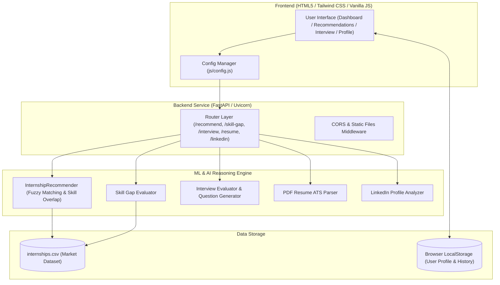

# 🚀 internSarthi — AI-Powered Internship Recommendation & Career Readiness Platform

[](https://www.python.org/)
[](https://fastapi.tiangolo.com/)
[](https://tailwindcss.com/)
[](https://pytest.org/)
[](LICENSE)

**internSarthi** is an intelligent, AI-driven career guidance and internship recommendation ecosystem built to democratize opportunity for students and early-career job seekers—especially those from tier-2/3 cities and low-digital backgrounds. 

By evaluating user skill profiles against real-world internship market demands, **internSarthi** delivers personalized internship matching, pinpoints missing skills, provides dynamic learning roadmaps, parses resumes for ATS optimization, and offers AI-powered mock interview feedback.

---

## 💡 Key Features

- **🎯 AI Internship Recommender**: Intelligent matching algorithm that scores role relevance, skill overlaps, and ranks primary and related opportunities.
- **📊 Dynamic Skill Gap Analysis**: Computes exact missing skills for each internship listing and provides step-by-step learning roadmaps.
- **🤖 Interactive AI Mock Interview Practice**: Role-specific interview questions and confidence evaluation based on domain keyword extraction.
- **📄 Resume ATS Analyzer**: Extracts technical skills from PDF resumes and evaluates ATS compatibility score with targeted improvement tips.
- **💼 LinkedIn Profile Optimizer**: Analyzes profile text to identify target role alignment and suggests high-impact missing industry keywords.
- **📈 Personal Progress Dashboard**: Tracks saved internships, application status, ATS score benchmarks, and past mock interview history in one unified interface.
- **🌐 Dynamic API URL Auto-Detection**: Seamlessly switches between local dev environment (`http://127.0.0.1:8001`) and live production deployment.

---

## 🏗️ System Architecture & Data Flow



---

## 🛠️ Tech Stack Matrix

| Layer | Technologies & Tools |
| :--- | :--- |
| **Frontend** | HTML5, Tailwind CSS (CDN), JavaScript (ES6+), Plus Jakarta Sans Fonts |
| **Backend API** | Python 3.10+, FastAPI, Uvicorn (ASGI Server), Pydantic v2 |
| **Data Science / ML** | Pandas, Scikit-Learn, PyPDF2, Difflib SequenceMatcher |
| **Testing** | Pytest, FastAPI TestClient, HTTPX |
| **Deployment** | Render, Local Uvicorn Development Server |

---

## 📡 API Reference & Endpoints

### 1. Internship Recommendation
- **Endpoint**: `POST /recommend`
- **Request Payload**:
  ```json
  {
    "role": "Data Analyst",
    "user_skills": ["python", "sql", "excel"]
  }
  ```
- **Response Sample**:
  ```json
  [
    {
      "internship_title": "Data Analyst Intern",
      "company_name": "Tech Corp",
      "location": "Remote",
      "match_type": "primary",
      "match_score": 85,
      "skills_you_have": ["Python", "SQL"],
      "skills_to_learn": ["Power BI", "Tableau"]
    }
  ]
  ```

### 2. Skill Gap Calculation
- **Endpoint**: `POST /skill-gap/`
- **Request Payload**:
  ```json
  {
    "role": "Data Analyst",
    "user_skills": ["python", "sql"]
  }
  ```
- **Response Sample**:
  ```json
  {
    "skills_you_have": ["python", "sql"],
    "skills_to_learn": ["tableau", "power bi", "excel"],
    "gap_percentage": 60
  }
  ```

### 3. Mock Interview Questions & Evaluation
- **Endpoint**: `POST /interview/questions` (`{"role": "Data Analyst"}`)
- **Endpoint**: `POST /interview/evaluate`
  ```json
  {
    "role": "Data Analyst",
    "answer": "I use python pandas for data cleaning and sql for database queries."
  }
  ```

### 4. Resume ATS Parser
- **Endpoint**: `POST /resume/analyze` (Multipart Form Data with PDF file)

### 5. LinkedIn Profile Analyzer
- **Endpoint**: `POST /linkedin/analyze` (`{"profile_text": "...", "target_role": "Data Analyst"}`)

---

## 🚀 Local Quick-Start Guide

### Prerequisites
- Python 3.10 or higher installed
- Git installed
- Web browser (Chrome, Firefox, Edge)

### 1. Clone Repository & Setup Virtual Environment
```bash
# Clone repository
git clone https://github.com/Itsbhavesh1101/internSarthi.git
cd internSarthi

# Create virtual environment
python -m venv venv

# Activate virtual environment
# On Windows:
venv\Scripts\activate
# On Linux/Mac:
source venv/bin/activate
```

### 2. Install Dependencies
```bash
pip install -r requirements.txt
```

### 3. Run Backend API Server
```bash
# Start server on port 8001
python -m uvicorn backend.main:app --reload --port 8001
```
> The API server will start at `http://127.0.0.1:8001`. You can access interactive Swagger API documentation at `http://127.0.0.1:8001/docs`.

### 4. Open Frontend App
- Open `frontend/index.html` directly in your browser, or visit `http://127.0.0.1:8001/` when static file serving is active.

---

## 🧪 Running Automated Tests

The repository includes a pytest suite covering all backend API routes.

```bash
python -m pytest tests/
```

---

## 📂 Project Directory Structure

```text
internSarthi/
├── backend/
│   ├── main.py                     # Main FastAPI application entrypoint & static mounting
│   ├── requirements.txt            # Backend Python dependencies
│   ├── ml/
│   │   ├── recommender.py          # Fuzzy matching & skill similarity recommendation engine
│   │   ├── skill_gap.py            # Static skill gap evaluator
│   │   ├── skill_gap_dynamic.py    # Dynamic skill gap extractor
│   │   ├── resume_parser.py        # PDF resume text extraction & ATS scoring
│   │   ├── linkedin_analyzer.py    # LinkedIn profile text keyword analyzer
│   │   ├── interview_questions.py  # Interview question database per role
│   │   ├── interview_evaluator.py  # Answer scoring & keyword matching
│   │   ├── career_suggester.py     # Next career action recommendations
│   │   ├── experience_scorer.py    # Experience scoring logic
│   │   └── dashboard_state.py      # In-memory state manager
│   └── routes/
│       ├── recommend.py            # Primary recommendation endpoint
│       ├── recommend_advanced.py   # Advanced multi-signal recommendation endpoint
│       ├── skill_gap.py            # Skill gap router
│       ├── interview.py            # Interview questions & evaluation router
│       ├── resume.py               # Resume upload router
│       ├── linkedin.py             # LinkedIn analyzer router
│       ├── dashboard.py            # User dashboard state router
│       ├── career.py               # Career suggestions router
│       └── internship_detail.py    # Internship detail retrieval router
├── data/
│   └── internships.csv             # Structured dataset of internship opportunities
├── frontend/
│   ├── index.html                  # Landing page with user registration
│   ├── profile.html                # User profile setup & resume upload
│   ├── recommend.html              # Recommendation matches with match badges
│   ├── skill_gap.html              # Personalized learning path & skill roadmaps
│   ├── internship_details.html     # Deep dive into individual internship listing
│   ├── interview.html              # Interactive mock interview practice UI
│   ├── linkedin.html               # LinkedIn text & keyword optimizer UI
│   ├── dashboard.html              # Personal career tracker & stats dashboard
│   └── js/
│       └── config.js               # Centralized dynamic API base URL configuration
├── tests/
│   └── test_api.py                 # Comprehensive Pytest suite for API endpoints
├── .gitignore                      # Environment & cache ignore rules
├── requirements.txt                # Unified project dependencies
└── README.md                       # Project documentation
```

---

## 📝 License

This project is licensed under the [MIT License](LICENSE).

---

## 👤 Author & Maintainer

**Bhavesh Barmashe**  
*Bachelor of Computer Science Engineering*  
*AI / ML Enthusiast*  
- GitHub: [@Itsbhavesh1101](https://github.com/Itsbhavesh1101)
